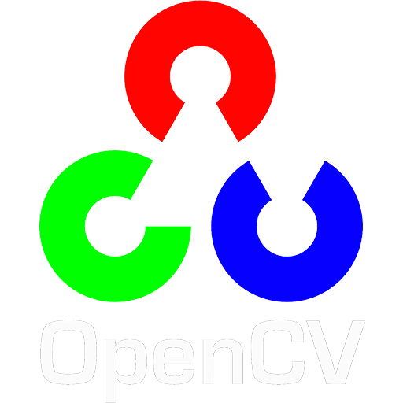

# OpenCV_IMAGE_PROCESSING

## Language Used: 

## Libraries Used

    
    
    

### Contains Python 3 Scripts for various functions available in the OpenCV Library of Python. 

These Python scripts are a result of video series on Youtube channel namely sentdex available in the playlist [OpenCV with Python for Image and Video Analysis](https://youtube.com/playlist?list=PLQVvvaa0QuDdttJXlLtAJxJetJcqmqlQq&si=PMxyl7mhrwOLzOwE").

The playlist is created by sentdex, a channel that provides tutorials on programming, data analysis, machine learning, and more. The videos cover topics such as loading images and videos, drawing and writing on images, image operations, thresholding, color filtering, blurring and smoothing, morphological transformations, edge detection and gradients, template matching, grabcut foreground extraction, corner detection, feature matching, MOG background reduction, Haar cascade object detection, making your own Haar cascade, and using Haar cascade for image and video object classification. 
The playlist is suitable for beginners who want to learn how to use OpenCV with Python for various image and video processing tasks. The playlist has a total duration of 3 hours and 42 minutes. 

### Following are the necessary links for installing requirements:

1. [Python](https://www.python.org/downloads/")

2. [OpenCV](https://pypi.org/project/opencv-python/")

3. [Matplotlib](https://matplotlib.org/stable/users/installing/index.html)

4. [Numpy](https://numpy.org/install/)

